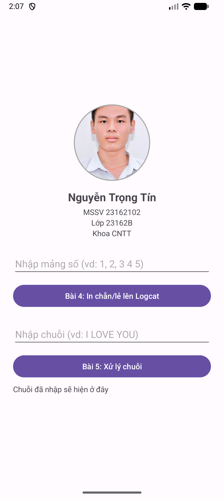
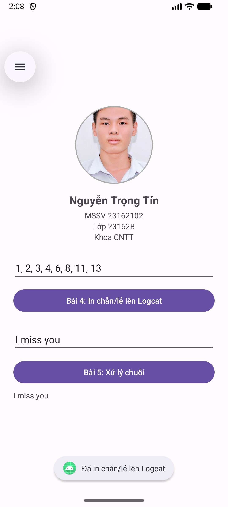
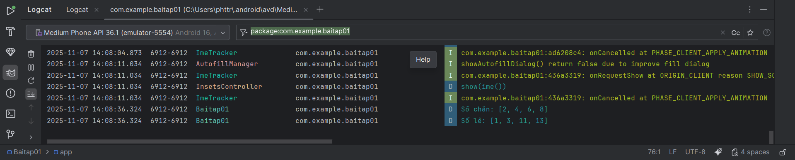
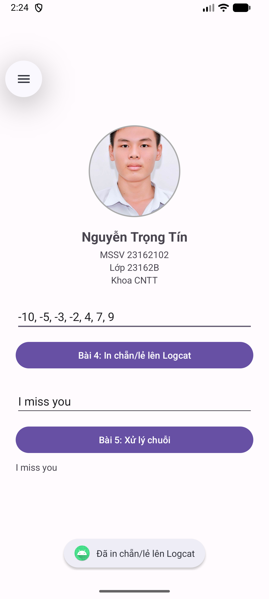
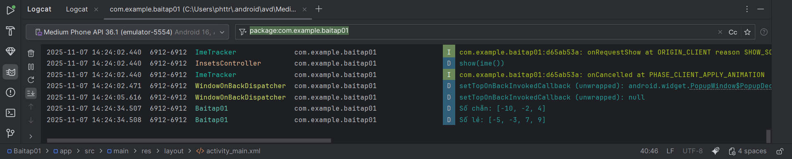
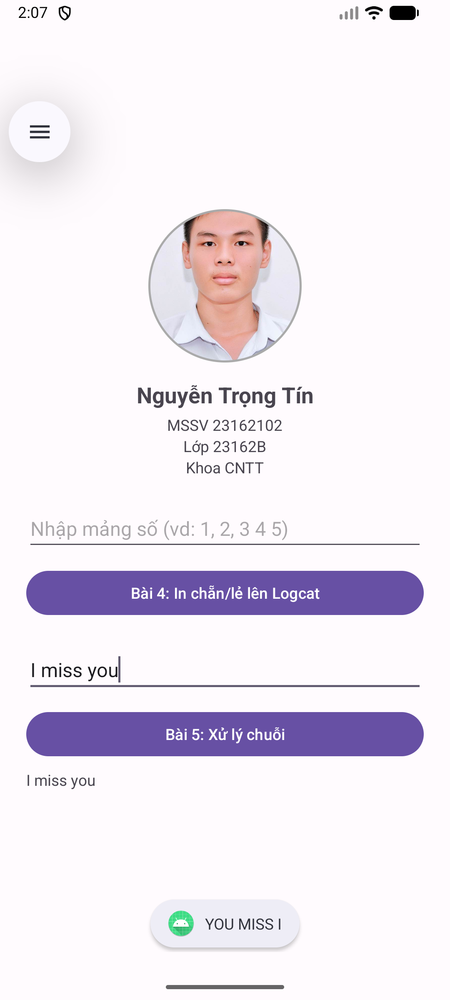

# Baitap01 — Lập trình di động MOPR (Android/Kotlin)

Hoàn thành: **CircleImageView** + **NoActionBar** + **Bài 4** (in chẵn/lẻ) + **Bài 5** (đảo chuỗi in hoa).

## Nội dung & trạng thái
- [x] Cài Android Studio
- [x] 1 Activity hiển thị ảnh tròn + thông tin SV (MSSV, Lớp, Khoa)
- [x] Ẩn **Action Bar** (Theme.Material3.DayNight.NoActionBar)
- [x] **Bài 4**: Nhập mảng số → in **chẵn/lẻ** lên **Logcat**
- [x] **Bài 5**: Nhập chuỗi → hiển thị ở **TextView**, **Toast** chuỗi **đảo theo từ** và **IN HOA**

## Screenshots

### Màn hình chính


### Bài 4 — Lần 1
UI | Logcat
:--:|:--:
 | 

### Bài 4 — Lần 2
UI | Logcat
:--:|:--:
 | 

### Bài 5


> Ví dụ: `I miss you` → Toast: **`YOU MISS I`**

## Cách chạy
1. Mở Android Studio → `File > Open` → chọn thư mục dự án.  
2. Sync Gradle.  
3. Chọn emulator (Medium Phone API 36) → **Run**.

## Thư viện dùng
```gradle
implementation "de.hdodenhof:circleimageview:3.1.0"
